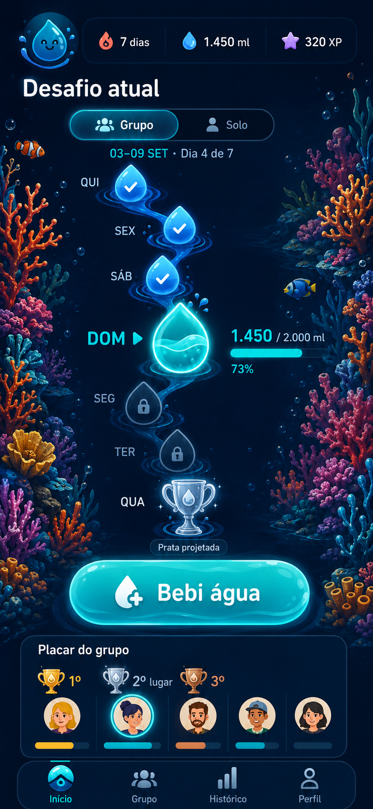

# Aqualino MVP

## Resultado do produto

O Aqualino ajuda pessoas a formar o hábito de beber água por meio de um ciclo curto: abrir o aplicativo, visualizar o desafio atual, registrar água em até dois toques, receber uma recompensa visual e acompanhar a evolução pessoal ou de um pequeno grupo de amigos.

O produto é uma ferramenta de hábito e não oferece aconselhamento médico. A experiência pode se inspirar na clareza de progressão do Duolingo, mas deve usar identidade, componentes, textos, ilustrações e linguagem visual próprios do Aqualino.

## Referência visual da Home



O mockup registra a direção de layout. Na implementação, o mascote ilustrativo deve ser substituído pelos assets oficiais já existentes no projeto.

## Pilares obrigatórios

### 1. Primeiro acesso, idioma e onboarding

A primeira configuração exibida ao abrir o aplicativo é a escolha de idioma, antes da autenticação, das boas-vindas ou de qualquer outra decisão. As opções do MVP aparecem em seus próprios idiomas:

- Português (Brasil) — `pt-BR`;
- English — `en`;
- Español — `es`;
- 简体中文 — `zh-Hans` (chinês simplificado).

O idioma do sistema pode vir pré-selecionado quando for suportado, mas a pessoa confirma a escolha. Ela é salva localmente de imediato para funcionar offline e, depois da autenticação, sincronizada com o perfil. Em dispositivos autenticados, a configuração da conta é a fonte de verdade.

A troca posterior em Configurações deve atualizar imediatamente, sem reiniciar o app, todas as telas, modais, validações, mensagens de erro, labels de acessibilidade, datas, números, notificações e textos do widget. Conteúdo criado por usuários, como nomes de perfil e grupo, não é traduzido automaticamente.

Todas as chaves são distribuídas com o aplicativo para os quatro idiomas. Chave ausente usa `pt-BR` como fallback, registra telemetria sem dados pessoais e nunca exibe o identificador técnico na interface. Chinês tradicional poderá ser adicionado futuramente como `zh-Hant`, sem reutilizar incorretamente as traduções simplificadas.

O cadastro e o acesso à conta ficam dentro do fluxo visual de steps. Na implementação atual, o terceiro step oferece cadastro ou login por e-mail e senha sem navegar para uma tela de autenticação separada. Google, Facebook ou Apple poderão ser incorporados nesse mesmo step; para provedores sociais, o aplicativo inicia o fluxo nativo e entrega ao backend o token de identidade para validação.

Depois do logout, a entrada mostra as identificações das contas usadas recentemente e a ação “Adicionar nova conta”. Selecionar uma conta lembrada preenche somente o e-mail e continua exigindo senha; token e senha nunca são mantidos nesse histórico. “Adicionar nova conta” reinicia o fluxo no idioma, depois meta diária e, por fim, autenticação. Só um token de sessão permanece ativo no dispositivo.

Depois da escolha de idioma e da autenticação, o usuário conclui um onboarding curto antes de chegar à Home. O progresso é persistido por etapa para continuar do mesmo ponto após fechar o aplicativo.

Etapas obrigatórias:

1. confirmar o idioma global;
2. conhecer a proposta do Aqualino e aceitar os documentos necessários;
3. definir nome público;
4. escolher um modelo visual de personagem entre os assets oficiais disponíveis;
5. definir a meta diária de água por uma sugestão do app ou valor personalizado válido;
6. escolher os volumes rápidos de copo ou garrafa;
7. confirmar o fuso horário.

A escolha de personagem é cosmética: não concede XP, vantagem no desafio ou diferença de pontuação. O catálogo possui códigos estáveis, nome, preview e assets para os estados necessários. O personagem pode ser alterado depois no perfil; se um asset falhar, o modelo padrão é usado como fallback.

Etapas configuráveis:

8. ativar ou desativar lembretes, escolher horários, dias da semana e período silencioso;
9. visualizar o widget e tocar em “Adicionar à tela inicial”.

Idioma, meta diária e personagem precisam ser definidos para concluir o onboarding. Lembretes e widget podem ser adiados. A permissão do sistema para notificações só é solicitada depois que o usuário ativa lembretes. Para o widget, o app abre o fluxo oferecido pela plataforma quando disponível e mostra instruções quando a instalação manual for necessária. Recusar ou pular qualquer permissão não bloqueia o uso do app.

Antes de oferecer o widget, o aplicativo grava um snapshot inicial com personagem, meta e estado atual. As configurações ficam disponíveis posteriormente em Perfil e Configurações.

### 2. Home focada no desafio atual

Após autenticação e onboarding, a Home é a rota inicial. Sua área principal apresenta uma trilha fluida com os dias do desafio selecionado.

- sem desafio ativo, a trilha mostra a semana civil atual, de segunda-feira a domingo;
- em um desafio de grupo, mostra os sete dias da janela do grupo, mesmo que atravesse duas semanas civis;
- em um desafio solo, mostra a duração definida pela modalidade escolhida;
- se grupo e solo estiverem ativos ao mesmo tempo, um seletor `Grupo | Solo` alterna a trilha sem misturar os placares;
- o intervalo de datas e o fuso aplicável ficam visíveis para não confundir “semana” com a janela do desafio.

A trilha deve:

- destacar o dia atual e manter a ação “Bebi água” imediatamente acessível;
- representar cada dia como uma etapa com os estados `futuro`, `sem registro`, `em progresso`, `meta atingida` e `perdido`;
- exibir estado também por ícone e texto, sem depender apenas de cor;
- transformar a última etapa do desafio em um troféu;
- mostrar no topo total de hoje, percentual da meta, sequência atual e XP;
- permitir abrir o resumo de um dia anterior sem retirar o foco do dia atual;
- oferecer volumes rápidos, como 200 ml, 300 ml, 500 ml e 750 ml;
- registrar um volume rápido em até dois toques;
- preservar estados de carregamento, vazio, offline, erro e sincronização pendente.

A composição pode usar uma corrente d’água curva ou vertical com gotas, ondas e recipientes. Corais inspirados em espécies reais podem ocupar as bordas como ambientação, usando tons de laranja, salmão, vermelho, rosa, magenta, roxo e amarelo. Eles não podem competir com o conteúdo, reduzir contraste, sugerir botões ou prejudicar áreas de toque.

Não reproduzir mapas, moedas, personagens, componentes ou identidade visual de outro produto.

### 3. Sequências separadas

O MVP diferencia duas sequências:

- `hydration streak`: dias civis consecutivos com pelo menos um registro válido de água;
- `challenge streak`: dias consecutivos em que a meta específica do desafio foi atingida dentro da sua janela.

Regras da sequência de hidratação:

- login ou abertura do aplicativo, sem registrar água, não mantém a sequência;
- o primeiro registro válido de 50 ml ou mais ativa o dia no fuso IANA do perfil;
- registros adicionais no mesmo dia não aumentam a sequência novamente;
- atingir a meta diária recebe destaque e bônus próprios, mas não é obrigatório para preservar a sequência;
- um registro offline ativa a sequência visualmente como pendente até a confirmação do servidor;
- repetição do mesmo `client_event_id` não concede sequência ou XP em duplicidade;
- editar ou excluir o último registro válido recalcula a sequência de forma determinística;
- uma quebra só pode ser protegida ou recuperada pelas poções previstas neste documento; a poção nunca cria um registro de água, volume, XP ou pontuação fictícios.

O backend é a fonte de verdade para as duas sequências. A interface pode fazer atualização otimista, mas deve reconciliar a resposta do servidor.

### 4. Motion com linguagem de água

As transições fazem parte da experiência principal, e não são apenas decoração.

O MVP deve incluir:

- entrada do aplicativo com revelação suave, como preenchimento, onda ou expansão de gota;
- mudança entre loading, conteúdo e erro sem cortes bruscos;
- abertura e fechamento de modais e bottom sheets com movimento contínuo, opacidade e escala leves;
- confirmação de água registrada com onda, ripple ou preenchimento;
- avanço da etapa do dia e das sequências sem bloquear o próximo toque;
- revelação curta e dispensável para streaks, troféus, medalhas e conquistas;
- passagem visual do último dia para o troféu final;
- feedback tátil opcional nas ações de registro e conquista.

Diretrizes verificáveis:

- priorizar `transform` e `opacity` para evitar trabalho desnecessário de layout;
- manter animações comuns entre 180 ms e 450 ms;
- não bloquear interação ou navegação enquanto uma celebração termina;
- evitar animações simultâneas excessivas;
- respeitar a preferência de redução de movimento do sistema, usando `fade` curto;
- manter conteúdo e controles utilizáveis mesmo se uma animação ou asset falhar;
- usar apenas os assets próprios já fornecidos para o Aqualino.

### 5. Grupo privado e desafio de sete dias

Uma pessoa pode criar ou participar de um grupo privado com no máximo cinco integrantes, contando quem criou o grupo.

Escopo do grupo:

- nome e avatar do grupo;
- convite por código ou link profundo e entrada somente após aceite explícito;
- mínimo de duas e máximo de cinco pessoas para iniciar o desafio;
- um único grupo ativo por pessoa;
- saída voluntária, remoção pelo responsável e transferência simples de responsabilidade;
- somente integrantes aceitos podem consultar progresso, placar e perfis do grupo;
- ausência de chat, feed público e descoberta aberta de usuários.

#### Janela do desafio

- quando o grupo se torna elegível, o primeiro desafio começa às 00:00 do dia seguinte no fuso do grupo;
- se o grupo começar na quarta-feira, o desafio começa na quinta-feira;
- cada desafio dura sete dias civis consecutivos e termina às 23:59:59 do sétimo dia;
- `end_date` é sempre `start_date + 6 dias`;
- o elenco é travado no início; quem entrar depois participa somente do próximo desafio;
- concluída uma janela, a próxima começa no dia seguinte com os integrantes então elegíveis;
- o backend devolve início, fim, fuso, status e versão da regra.

#### Pontuação e premiação

Para cada integrante, a pontuação diária é o percentual da própria meta, limitado a 100 pontos. A pontuação final soma os sete dias, com máximo de 700 pontos. Beber acima da meta continua registrado, mas não aumenta a pontuação competitiva.

O placar mostra nome, avatar, volume, percentual, pontos acumulados, posição ou empate. Horários detalhados dos registros não são compartilhados.

As posições usam classificação de competição: pessoas empatadas recebem a mesma posição e a posição seguinte é pulada. A premiação visual é:

- 1º lugar: ouro;
- 2º lugar: prata;
- 3º lugar: bronze;
- demais posições: conclusão sem medalha de pódio.

Durante o desafio, o troféu da última etapa mostra a premiação projetada. Após o fechamento pelo servidor, a cor e a medalha tornam-se definitivas. Um empate concede a mesma medalha às pessoas empatadas.

Além da medalha de ouro, cada participante que terminar em 1º lugar recebe exatamente um sorteio gratuito e independente, processado pelo servidor após o fechamento definitivo do placar. A tabela inicial é:

| Resultado | Probabilidade | Concessão |
| --- | ---: | --- |
| XP extra | 70% | `+100 XP` |
| Congelamento de streak | 20% | `1x streak_freeze` |
| Poção de reacender o streak | 10% | `1x streak_revive` |

As probabilidades devem somar 100%, ficar visíveis nas regras do desafio antes de seu início e ser armazenadas com uma versão. XP extra deve permanecer o resultado mais provável. Empates em 1º lugar geram um sorteio por vencedor, com as mesmas probabilidades e sem influência do plano Pro. O prêmio é concedido uma única vez por `user_id + challenge_id`; uma poção recebida entra no inventário pessoal somente depois que o desafio de grupo estiver `completed` e não pode alterar o placar encerrado.

### 6. Desafios solo por modalidade

O usuário não configura livremente duração ou volume. Ele escolhe uma modalidade publicada em um catálogo versionado pelo backend. Cada modalidade define nome, duração, meta diária em mililitros, XP, limiares de medalha e conquista exclusiva.

Catálogo inicial sugerido:

| Modalidade | Duração | Meta por dia | Bronze | Prata | Ouro | Conquista exclusiva |
| --- | ---: | ---: | ---: | ---: | ---: | --- |
| Maré Inicial | 3 dias | 1.500 ml | 1 dia seguido | 2 dias seguidos | 3 dias seguidos | Primeira Maré |
| Corrente Forte | 5 dias | 1.800 ml | 3 dias seguidos | 4 dias seguidos | 5 dias seguidos | Mestre da Corrente |
| Oceano Azul | 7 dias | 2.000 ml | 3 dias seguidos | 5 dias seguidos | 7 dias seguidos | Guardião do Oceano |

Os valores são configuração de produto, não recomendação médica. Uma modalidade só pode ser iniciada quando sua meta não ultrapassa a meta diária configurada no perfil.

Regras:

- somente um desafio solo pode estar `scheduled` ou `active` por pessoa;
- escolher outra modalidade exige concluir ou cancelar o desafio atual;
- o desafio começa às 00:00 do próximo dia civil no fuso individual;
- o troféu final usa a maior `challenge streak` obtida durante a janela e os limiares da modalidade;
- um desafio solo pode coexistir com o desafio do grupo;
- XP do desafio é provisório até a conclusão;
- cancelar exige confirmação, define o desafio como `cancelled`, zera sua `challenge streak`, revoga o XP provisório e impede medalha ou conquista;
- registros de água, `hydration streak` e XP normal de hidratação não são apagados pelo cancelamento;
- um desafio cancelado não pode ser retomado, mas outro pode ser agendado para o próximo dia.

Conquistas e medalhas concluídas aparecem no perfil. No MVP, apenas integrantes aceitos do mesmo grupo podem visitar esse perfil e consultar a vitrine; perfis não são públicos nem pesquisáveis globalmente.

### 7. Plano Pro e anúncios

A primeira entrega usa modelo Freemium:

- o plano gratuito mantém todas as funções centrais de hidratação, streak, desafios, grupos, conquistas e widget;
- o plano **Aqualino Pro** remove todos os anúncios enquanto o entitlement estiver ativo;
- Pro também concede um badge cosmético **VIP** enquanto o entitlement estiver ativo ou em período de carência;
- a cada mês com entitlement `pro_active`, o VIP recebe uma pequena cota de `1x streak_freeze` e `1x streak_revive`;
- o VIP recebe desconto inicial de 15% nas poções, por uma oferta/SKU suportada pela loja e configurada remotamente;
- Pro não concede XP, personagem, conquista, pontos, melhores probabilidades ou qualquer vantagem em desafios de grupo.

O badge VIP é derivado do entitlement, não é uma conquista permanente. Deve aparecer com ícone e texto, sem depender apenas de cor:

- no cabeçalho do próprio perfil;
- no perfil visitado por integrantes aceitos do mesmo grupo;
- ao lado do nome/avatar nos participantes e no placar do grupo.

Somente o badge é compartilhado. Preço, período, renovação, expiração e demais informações de cobrança permanecem privados. Em `expired` ou `revoked`, o badge desaparece após a reconciliação; em `pro_active` ou `grace_period`, continua visível. A interface nunca pode confiar em uma flag VIP criada apenas no cliente.

O aplicativo deve permitir consultar a oferta, assinar, restaurar compras e abrir o gerenciamento da assinatura pela loja da plataforma. Preço, período, teste gratuito e identificadores dos produtos são configuração comercial e precisam ser aprovados antes da publicação; não devem ficar hardcoded na interface.

#### Momento dos anúncios

No plano gratuito, um anúncio só pode ficar elegível após a criação de um registro de água iniciada pela pessoa e finalizada com sucesso pelo backend. A ordem é obrigatória:

```text
Pessoa confirma a quantidade
    ↓
Registro é persistido e reconciliado
    ↓
Home, streak, XP, desafio e widget são atualizados
    ↓
Feedback de sucesso termina sem bloqueio
    ↓
Anúncio pós-registro pode ser exibido
```

Regras:

- nunca mostrar anúncio antes, durante ou como condição para salvar água;
- não mostrar anúncio para registro offline ainda pendente, sincronização em background, retry idempotente, edição ou exclusão;
- falha, indisponibilidade ou demora do anúncio não altera o registro nem bloqueia a navegação;
- conquista, meta atingida ou troféu são revelados antes de qualquer anúncio elegível;
- não usar anúncio recompensado para conceder água, XP, streak ou vantagem;
- não mostrar anúncios no onboarding, autenticação, configuração de lembretes, instalação do widget ou tela de compra/restauração;
- o fechamento deve ser acessível e respeitar as regras da loja e do provedor;
- textos de consentimento e controles do anúncio acompanham o idioma global;
- não enviar volume consumido, meta, streak ou participação em desafios para a rede de anúncios.

Uma oportunidade de anúncio é vinculada ao `client_event_id` e consumida no máximo uma vez. A política inicial limita a um anúncio a cada três registros finalizados, com intervalo mínimo de dez minutos e máximo de três anúncios por dia. Esses limites são configuração remota versionada e podem ficar mais restritivos sem nova publicação.

O entitlement Pro é verificado no servidor a partir da compra oficial da loja e mantido em cache local para funcionamento offline. Estados mínimos: `free`, `pro_active`, `grace_period`, `expired` e `revoked`. Durante `pro_active` ou `grace_period`, nenhum anúncio é solicitado ou exibido. Restaurações, renovações, cancelamentos e reembolsos precisam ser reconciliados de forma idempotente.

### 8. Poções, inventário e proteção de streak

As poções são itens consumíveis do inventário pessoal. Usuários gratuitos e VIP podem comprar os dois tipos; o plano gratuito não perde acesso a nenhum deles.

| Código | Nome exibido | Efeito |
| --- | --- | --- |
| `streak_freeze` | Congelamento de streak | Depois de ativado, protege o próximo dia elegível perdido da sequência selecionada e é consumido somente quando a proteção for necessária. |
| `streak_revive` | Poção de reacender o streak | Recupera a quebra mais recente da sequência selecionada quando usada em até 48 horas após a quebra. |

Regras de uso:

- cada unidade atua em apenas uma sequência selecionada: `hydration streak` pessoal ou `challenge streak` de um desafio solo;
- um dia protegido ou recuperado é marcado como tal na interface e no histórico; ele não recebe registro de água, volume, meta diária, XP, pontos, medalha ou conquista que não tenham sido realmente obtidos;
- não é possível empilhar duas poções sobre a mesma quebra nem consumir mais de uma unidade para o mesmo dia e escopo;
- ativação e recuperação exigem confirmação do servidor; o saldo local pode ser exibido offline, mas não consumido offline;
- durante um desafio de grupo `active`, nenhuma poção pode ser ativada, consumida automaticamente ou usada para recuperar uma sequência; uma proteção armada é suspensa sem consumo até o desafio terminar e depois volta a valer apenas para uma falta futura, nunca para uma quebra ocorrida durante o grupo;
- poções nunca alteram volume, pontuação, posição, `challenge streak`, medalha ou recompensa de um desafio de grupo;
- é permitido comprar e receber poções enquanto o grupo está ativo, mas elas permanecem guardadas até a janela terminar;
- o inventário não expira, é vinculado à conta, não pode ser transferido e não possui valor em dinheiro.

Compras de poções usam produtos consumíveis e o mecanismo oficial de cobrança da App Store ou Google Play. O servidor valida cada transação e credita o inventário de forma idempotente pelo identificador externo da compra. Preço, pacote e desconto exibidos pela loja são a fonte de verdade; o cliente nunca calcula ou concede o desconto sozinho.

Ao reinstalar o app ou trocar de dispositivo, o saldo é recuperado da conta no backend; restaurar compras não recria uma poção já consumida nem duplica uma unidade já creditada. Se o desafio solo associado terminar ou for cancelado com Congelamento armado, a reserva é liberada sem consumir a unidade.

A cota mensal VIP é creditada uma única vez por competência `YYYY-MM` enquanto o entitlement estiver `pro_active`, inclusive para assinaturas anuais. Ela acumula no inventário e não expira. `grace_period`, renovação repetida, reinstalação ou restauração não duplicam a cota. Ao cancelar ou perder o Pro, a pessoa mantém as poções já recebidas ou compradas, mas deixa de receber novas cotas e perde o desconto em compras futuras.

O desconto VIP inicial de 15% é uma regra comercial configurável. Sua publicação depende da criação de produto/oferta compatível em cada loja; se uma loja não suportar exatamente esse percentual, a interface mostra o preço oficial daquela loja sem prometer desconto diferente. Nenhuma compra oferece prêmio aleatório: o sorteio de 1º lugar é gratuito e suas probabilidades são divulgadas nas regras do desafio.

## Conquistas básicas do MVP

- **Primeira gota:** realizar o primeiro registro válido;
- **Em ritmo:** alcançar três dias de `hydration streak`;
- **Semana azul:** alcançar sete dias de `hydration streak`;
- **Dia completo:** atingir a meta diária pela primeira vez;
- **Em equipe:** entrar no primeiro grupo;
- **Primeiro desafio:** concluir a primeira janela em grupo;
- **Onda dourada, prateada ou bronze:** finalizar uma janela na respectiva posição;
- **Primeira Maré, Mestre da Corrente e Guardião do Oceano:** concluir as respectivas modalidades solo com os critérios do catálogo.

Cada conquista é concedida de forma idempotente pelo backend. A revelação animada pode ser fechada imediatamente e não impede o registro seguinte.

## Primeira entrega utilizável

- criar conta, entrar, sair e revogar o token atual;
- escolher entre `pt-BR`, `en`, `es` e `zh-Hans` antes da autenticação e trocar o idioma globalmente sem reiniciar;
- concluir um onboarding retomável no primeiro acesso;
- escolher um modelo de personagem entre os assets oficiais disponíveis;
- configurar nome público, fuso IANA, meta diária e volumes favoritos;
- configurar lembretes e solicitar permissão somente após consentimento contextual;
- oferecer a instalação do widget com fluxo do sistema ou instrução adequada à plataforma;
- abrir diretamente na Home após concluir o onboarding;
- consultar consumo, meta e etapas do desafio visível;
- registrar de 50 ml a 2.000 ml, online ou em fila local offline;
- sincronizar com `client_event_id` idempotente e reconciliar a atualização otimista;
- mostrar total, percentual, XP, sequências, conquistas e condição do Aqualino;
- criar ou entrar em um grupo privado de até cinco integrantes;
- acompanhar um desafio de grupo por sete dias e receber a premiação final;
- receber um sorteio gratuito de recompensa ao finalizar em 1º lugar, com XP como resultado mais provável;
- escolher, acompanhar, concluir ou cancelar uma modalidade solo;
- visitar a vitrine de conquistas de outro integrante do grupo;
- usar gratuitamente todas as funcionalidades centrais com anúncios controlados no pós-registro;
- comprar Congelamento e Poção de reacender, consultar o inventário e usá-los apenas fora do modo de grupo;
- assinar o Aqualino Pro, restaurar a compra, remover anúncios, exibir o badge VIP, receber a cota mensal e acessar o desconto de poções;
- devolver e persistir o snapshot versionado do widget;
- abrir o registro rápido por `aqualino://hydrate/quick?source=widget`;
- exibir widgets pequeno e médio a partir do último snapshot local;
- oferecer motion fluido nos momentos principais com alternativa de movimento reduzido.

## Fluxos principais

### Concluir o primeiro acesso

```text
Abrir o app e confirmar o idioma
    ↓
Criar conta ou entrar pela primeira vez
    ↓
Escolher personagem
    ↓
Definir meta, volumes rápidos e fuso
    ↓
Configurar ou pular lembretes
    ↓
Adicionar ou pular o widget
    ↓
Gravar snapshot inicial e abrir a Home
```

### Criar e iniciar um desafio de grupo

```text
Criar grupo privado e aceitar integrantes
    ↓
Grupo atinge pelo menos duas pessoas na quarta-feira
    ↓
Desafio fica agendado para quinta-feira às 00:00
    ↓
Sete dias de progresso e placar acumulado
    ↓
Última etapa em formato de troféu
    ↓
Servidor fecha o placar e concede ouro, prata ou bronze
    ↓
Para cada 1º lugar, sorteia e credita XP extra, Congelamento ou Poção de reacender
```

### Iniciar ou cancelar um desafio solo

```text
Escolher uma modalidade predefinida
    ↓
Validar que não existe outro solo ativo ou agendado
    ↓
Começar no próximo dia no fuso individual
    ↓
Cumprir a meta e formar a challenge streak
    ↓
Concluir e receber medalha/conquista

Cancelar antes do fim
    ↓
Perder challenge streak e XP provisório
    ↓
Preservar registros e progresso normal de hidratação
```

### Finalizar um registro no plano gratuito

```text
Salvar e reconciliar o registro
    ↓
Atualizar progresso, streak, XP, desafio e widget
    ↓
Exibir a recompensa visual aplicável
    ↓
Consultar elegibilidade e frequência
    ↓
Exibir anúncio pós-registro ou continuar sem interrupção
```

### Comprar e usar uma poção

```text
Abrir o inventário e consultar os preços oficiais da loja
    ↓
Comprar como usuário gratuito ou com a oferta VIP elegível
    ↓
Servidor valida a transação e credita uma única vez
    ↓
Fora de desafio de grupo ativo, escolher hydration streak ou desafio solo
    ↓
Ativar Congelamento para uma falta futura ou Reacender em até 48 horas
    ↓
Servidor consome uma unidade sem criar água, XP ou pontuação fictícios
```

## Critérios verificáveis

1. A escolha entre `pt-BR`, `en`, `es` e `zh-Hans` é a primeira tela no primeiro acesso e funciona sem autenticação ou rede.
2. Trocar o idioma atualiza imediatamente toda a interface, widget e preferências futuras de notificação, sem reiniciar.
3. Datas, números, plurais e labels de acessibilidade respeitam o locale; uma chave ausente cai para `pt-BR` sem mostrar códigos técnicos.
4. No primeiro acesso, o onboarding exige idioma, personagem e meta antes de liberar a Home e retoma da última etapa persistida após reiniciar o app.
5. Escolher outro personagem muda Home, perfil e próximo snapshot do widget sem alterar XP, sequência ou pontuação.
6. A permissão de notificações só é solicitada após ativar lembretes; recusá-la não impede concluir o onboarding.
7. A etapa do widget oferece o fluxo suportado pela plataforma ou instruções e pode ser pulada sem bloquear o app.
8. Após onboarding, a primeira tela funcional é a Home com a trilha atual e o dia vigente destacado.
9. Repetir `POST /api/v1/hydration/logs` com o mesmo `client_event_id` não duplica volume, XP, sequências nem pontuação.
10. Login isolado não altera a `hydration streak`; cumprir a meta do desafio altera a `challenge streak` uma vez por dia.
11. Grupo que se torna elegível na quarta-feira inicia sua janela na quinta-feira, no fuso do grupo, e termina sete dias depois inclusive.
12. O elenco do desafio é imutável após o início e o sexto integrante do grupo é rejeitado mesmo com aceites concorrentes.
13. A pontuação diária é limitada a 100, a pontuação final a 700 e volumes acima da meta não geram vantagem.
14. Empates seguem classificação de competição e as posições 1, 2 e 3 recebem ouro, prata e bronze.
15. A última etapa tem formato de troféu e muda de projeção para resultado definitivo após o fechamento.
16. O catálogo solo é versionado; o usuário não pode editar duração, meta, XP ou limiares.
17. Não é possível manter dois desafios solo ativos ou agendados.
18. Cancelar um solo revoga apenas sua sequência e XP provisórios, preservando registros e gamificação normal.
19. Conquistas finalizadas são visíveis no perfil para integrantes aceitos do mesmo grupo.
20. A fila offline sobrevive ao fechamento do app e somente posições confirmadas pelo servidor são definitivas.
21. Modais, registros, troféus e conquistas têm transição fluida e alternativa de movimento reduzido.
22. Regras, pontuações, cancelamentos e premiações são auditáveis e reconstruíveis a partir do PostgreSQL.
23. Todas as funções centrais e a compra dos dois tipos de poção continuam disponíveis no plano gratuito.
24. O anúncio gratuito somente pode aparecer após registro confirmado, reconciliação, atualização da interface e recompensa visual.
25. Registro offline pendente, retry do mesmo `client_event_id`, sincronização em background, edição e exclusão não criam nova oportunidade de anúncio.
26. Uma oportunidade é consumida no máximo uma vez e respeita intervalo, razão de registros e limite diário configurados.
27. Em `pro_active` ou `grace_period`, o aplicativo não solicita nem exibe anúncios.
28. Compra, restauração, renovação, expiração, cancelamento e reembolso atualizam o entitlement de forma idempotente.
29. Nenhuma informação de hidratação, streak ou desafio é enviada ao provedor de anúncios.
30. Oferta Pro, consentimento e anúncios respeitam o idioma global e os requisitos de acessibilidade.
31. Em `pro_active` ou `grace_period`, o badge VIP aparece no próprio perfil, no perfil autorizado e no placar/lista do grupo.
32. Em `expired` ou `revoked`, o badge VIP desaparece sem remover conquistas reais ou histórico do usuário.
33. Outros participantes veem somente o badge, nunca preço, datas ou situação detalhada de cobrança.
34. Uma compra validada credita o inventário uma única vez; usuários gratuitos e VIP podem comprar `streak_freeze` e `streak_revive`.
35. Cada competência mensal com `pro_active` concede exatamente uma unidade de cada poção, sem duplicar em retry, restauração ou reinstalação.
36. Cancelar o Pro preserva o inventário existente, interrompe cotas futuras e remove o desconto das próximas compras.
37. Congelamento protege somente o próximo dia elegível perdido da sequência selecionada; Reacender recupera somente a quebra mais recente em até 48 horas.
38. Usar uma poção não cria registro de água, volume, meta, XP, pontuação, medalha ou conquista fictícios.
39. Durante um desafio de grupo `active`, ativação, consumo automático e recuperação por poção são rejeitados, sem debitar o inventário.
40. Poções não alteram qualquer resultado de grupo; itens comprados ou recebidos durante a janela ficam guardados até seu encerramento.
41. Cada 1º lugar recebe um único sorteio idempotente com 70% de chance de `+100 XP`, 20% de `1x streak_freeze` e 10% de `1x streak_revive`.
42. As probabilidades do sorteio somam 100%, são visíveis antes do desafio, ficam versionadas e não mudam conforme o plano do participante.
43. O preço e o desconto da compra vêm da loja; o servidor valida a transação e o cliente não consegue conceder item ou desconto por alteração local.

## Métricas iniciais

- primeiro registro e dias ativos de hidratação;
- conclusão e abandono de cada etapa do onboarding;
- idioma selecionado e taxa de troca posterior por locale;
- distribuição dos modelos de personagem escolhidos;
- metas configuradas, adesão aos lembretes e uso de “Adicionar à tela inicial”;
- proporção de registros concluídos em até dois toques;
- sequências de hidratação e de desafio alcançadas;
- grupos que chegam a pelo menos dois integrantes;
- conclusão e abandono dos desafios de grupo;
- modalidades solo iniciadas, concluídas e canceladas;
- distribuição de medalhas e conquistas por modalidade;
- distribuição observada dos sorteios de 1º lugar por versão da tabela;
- compra, concessão VIP, saldos agregados e consumo de cada poção, sem enviar dados de hidratação à loja;
- taxa de proteção/recuperação de streak e tentativas bloqueadas durante modo de grupo;
- conversão, restauração, renovação e cancelamento do Pro;
- oportunidades, impressões e dispensas de anúncio por sessão, sem dados de hidratação no provedor;
- impacto dos anúncios na conclusão do registro e retenção;
- falhas e tempo de sincronização da fila offline;
- abandono durante animações ou modais.

## Fora desta entrega

- grupos com mais de cinco integrantes ou múltiplos grupos ativos;
- dois desafios solo simultâneos;
- criação livre de modalidades, duração, volume, XP ou prêmios pelo usuário;
- chat, feed público, comentários, reações livres ou perfis públicos;
- ligas públicas e matchmaking com desconhecidos;
- prêmios financeiros, apostas ou punições por perder;
- apagar registros reais de água ao cancelar um desafio;
- recomendações médicas ou incentivo para ultrapassar a meta;
- gráficos avançados e histórico detalhado dos desafios;
- registro direto dentro do widget;
- dependência obrigatória de Rive para concluir um fluxo;
- inteligência artificial generativa no fluxo principal;
- tradução automática de conteúdo escrito por usuários;
- chinês tradicional (`zh-Hant`) na primeira versão;
- benefícios Pro além da remoção de anúncios, badge VIP, cota mensal e desconto de poções descritos neste documento;
- vantagem competitiva, melhores probabilidades, XP direto ou desafios exclusivos vinculados ao VIP;
- troca, presente, venda entre jogadores ou conversão de poções em dinheiro;
- uso de poções em desafios de grupo;
- caixas, pacotes ou compras com resultado aleatório;
- anúncios recompensados ou vinculados a XP, streak, conquistas ou vantagens;
- banners permanentes e anúncios antes/durante o registro;
- personalização publicitária usando dados de hidratação ou desafios.

Notificações push e animações mais elaboradas podem evoluir após a Home, as sequências e os desafios estarem estáveis e mensurados.
