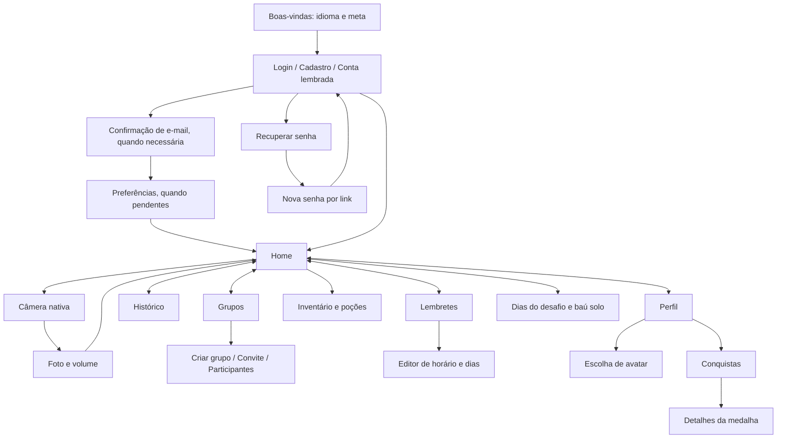

# Navegação autônoma do Aqualino

A ferramenta usa Python 3.10+ e o ADB do Android SDK. Lê a hierarquia nativa com UI Automator, encontra o controle por `testID`, acessibilidade ou texto e calcula o toque a partir da posição atual. Não exige Selenium, servidor Appium ou pacotes Python.

## Uso nas próximas tarefas

Da raiz do projeto:

```sh
pnpm mobile:nav doctor
pnpm mobile:nav connect
pnpm mobile:nav open home
pnpm mobile:nav inspect
pnpm mobile:nav tap nav.history --expect history
pnpm mobile:nav open inventory
pnpm mobile:nav back
pnpm mobile:nav run tour
```

Também funciona diretamente com `python3 scripts/mobile_nav.py …`, sem depender da versão do Node. `--serial SERIAL`, `--adb CAMINHO`, `--output PASTA` e `--timeout SEGUNDOS` são opções globais e vêm **antes** do comando. Se houver mais de um Android, informe `--serial` ou `ANDROID_SERIAL`. `AQUALINO_ADB`, `ANDROID_HOME` e `ANDROID_SDK_ROOT` permitem escolher o SDK.

1. Use `doctor` para identificar aparelho, instalação, bloqueio, API e Metro.
2. No debug, inicie `pnpm mobile:start` se necessário e execute `connect` para encaminhar as portas 8080 e 8081. O app deve estar instalado. Abra com `launch` ou `open home`.
3. Use `open TELA` para chegar diretamente a uma tela. O comando só termina com sucesso após identificar `screen-NomeDaRota`. As exigências de login, confirmação de e-mail e onboarding continuam valendo.
4. Use `inspect` antes de uma ação desconhecida. A resposta JSON informa a tela, presença de modal, nomes dos controles, estados e caminhos dos artefatos. Não reutilize coordenadas de capturas antigas.
5. Prefira `tap ALIAS --expect DESTINO` quando a ação mudar de tela. Para um modal, confira os novos controles com `inspect` e use `back` para fechar. Confirmações não são acionadas automaticamente.
6. Para verificar várias telas, execute um fluxo do mapa. Cada etapa gera evidências, duração e um relatório JSON/HTML. Uma falha interrompe o percurso e fica registrada como falha.

```sh
pnpm mobile:nav map
pnpm mobile:nav tap profile.avatar
pnpm mobile:nav wait 'text=Escolha seu avatar'
pnpm mobile:nav tap avatar.close
pnpm mobile:nav scroll down
pnpm mobile:nav scroll up --within id=onboarding-scroll
pnpm mobile:nav run avatar-preview
pnpm mobile:nav run water-preview
```

Seletores: `id=profile-avatar`, `label=Escolher avatar`, `text=Novo` e `contains=Registrar`. Textos podem mudar com o idioma; os aliases com `id` são estáveis. Seletores ambíguos, controles desabilitados e elementos fora da tela produzem erro em vez de um toque por aproximação. `scroll` usa a área rolável visível, sem coordenadas fixas por modelo de celular.

Para preencher campos, o valor vem de uma variável de ambiente. A ferramenta substitui o texto e **não envia** o formulário:

```sh
pnpm mobile:nav open login
# Defina AQUALINO_TEST_EMAIL e AQUALINO_TEST_PASSWORD fora do código/versionamento.
pnpm mobile:nav fill login.email --env AQUALINO_TEST_EMAIL
pnpm mobile:nav fill login.password --env AQUALINO_TEST_PASSWORD
pnpm mobile:nav tap login.submit --expect home
```

O teclado ADB deste Android aceita texto ASCII; caracteres acentuados e `%s` literal precisam do teclado do aparelho. O estado da conta é preservado: a ferramenta não reinstala o APK, limpa dados nem cria conta de teste. Fotografar, registrar água, selecionar avatar, salvar lembretes, usar poções e confirmar ações de grupo alteram dados e exigem comandos específicos fora do tour.

## Mapa de navegação

O mapa executável está em [map.json](map.json), com 14 telas, aliases de controles, painéis e fluxos. O teste de contrato confere se todas as rotas do app continuam mapeadas e se os deep links coincidem com `linking.ts`.



| Tela / grupo | Comando / identificação | Subfluxos |
| --- | --- | --- |
| Boas-vindas | `open welcome` | Idioma, meta, cadastro, login e contas lembradas |
| Segurança | `open login`, `forgot-password`, `reset-password`, `verify-email` | Recuperação e confirmação; links válidos continuam necessários |
| Preferências | `open onboarding` | Disponível quando o perfil está incompleto |
| Home | `open home` / `nav.home` | Desafio solo começa hoje; grupo no dia seguinte; gotas, baú, XP e nível |
| Grupos | `open groups` / `nav.groups` | Criar, visualizar convite, aceitar, participantes, compartilhar e sair |
| Lembretes | `open reminders` / `nav.reminders` | `reminders.new`, hora, minuto, dias, ativar e remover |
| Histórico | `open history` / `nav.history` | Selecionar dia, consumo e marcações |
| Perfil | `open profile` / `nav.profile` | `profile.avatar`, `profile.achievements`, sair |
| Inventário | `open inventory` / `home.inventory` | Poções para congelar ou reviver sequência |
| Conquistas | `open achievements` | Categorias, medalhas e detalhes |
| Água | `open hydrate` / `home.camera` | Deep link abre a seleção; botão da Home abre a câmera; foto obrigatória |
| Modais do app | `app-modal` em `inspect` | `back` respeita o estado ocupado e o fechamento permitido |

O percurso `tour` visita Home → Grupos → Lembretes → Histórico → Perfil → Inventário → Conquistas → Home, verificando também os botões reais da navbar. `avatar-preview` abre e fecha o editor sem selecionar avatar; `water-preview` confere a exigência de foto sem registrar água.

## Evidências e diagnóstico

As saídas ficam em `.artifacts/mobile-nav/SERIAL/`, fora do Git:

- Pasta por captura: `screen.png`, `hierarchy.xml` e `screen.json`.
- Fluxo: `tour-latest.json` e `tour-latest.html`, com miniaturas clicáveis e duração de cada etapa.
- Campos marcados como senha são ocultados no XML e JSON. Capturas e outros textos podem conter dados da conta; mantenha os artefatos locais.

Se o aparelho estiver bloqueado, desbloqueie-o manualmente. A ferramenta detecta essa condição e não tenta PIN, biometria ou remoção do bloqueio. Câmera e janelas de permissões do Android aparecem como telas externas e precisam de inspeção específica. Uma tela sem o identificador `screen-*` pode indicar um bundle antigo; confira o Metro e recarregue o app. O prazo de espera inclui leituras da árvore; uma leitura nativa individual pode levar até 25 segundos.

O executor atual é Android. iOS exige um Mac e um executor XCUITest/Appium; o mapa, deep links e `testID`s já podem ser reutilizados. A navegação física depende de dispositivo conectado, desbloqueado e sessão adequada ao destino.

```sh
pnpm mobile:nav:test
```

Referências: [Android Debug Bridge](https://developer.android.com/tools/adb), [UI Automator](https://developer.android.com/training/testing/other-components/ui-automator-legacy), [React Native testID](https://reactnative.dev/docs/view#testid).
